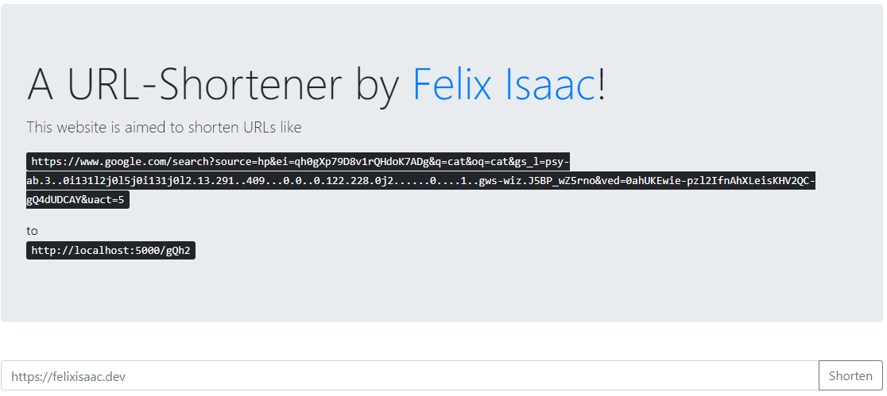

> [!NOTE]
> **📦 Archived — no longer maintained.**
> A weekend Flask + MySQL URL shortener from January 2020 — ~80 lines, 4-char random slugs, no collision handling, and a typo bug in the error path that was never caught. Got to "it runs locally" and stopped there.
> _Revisit if: honestly unlikely — kept as a record of early Flask work._

# URL-Shortener

## Shortens long URL to short and simple URLs.

Frontend:

---

Usage:

